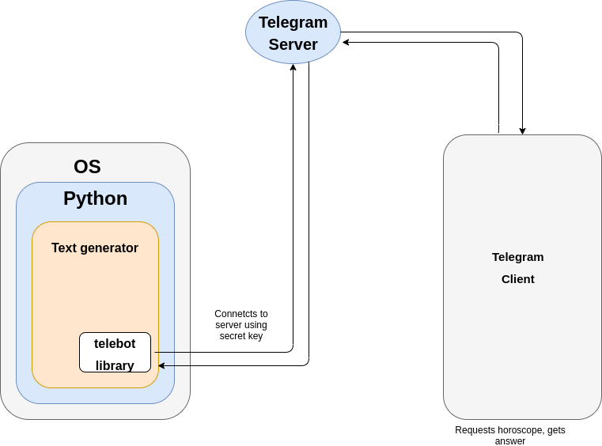

# Dune Horoscope
It's horoscope for inhabitants of the planet Arrakis - informally known as Dune

## What is it?
Telegram bot that generates horoscope.

The Python interpreter is running on the computer,
and our main.py is running inside the interpreter. 
It is responsible for all the content: it contains all the templates of the text,
all the logic, all the behavior.

Inside the Python program, there is a library that is responsible
for communicating with the Telegram server.

When a client with a Telegram requests a horoscope from the bot,
the request comes to the server, and the server sends it to our computer.
The request is processed by a Python program,
the answer goes to the Telegram server, the server sends the answer to the client.

## Included steps:
- We register the bot in Telegram.
- Install the Python library for working with Telegram
- We add the library to the program with the horoscope
  and teach the program to respond to messages in the chat.
- We write code that will show the buttons for selecting the signs of the zodiac.
- We make the horoscope appear when the button is pressed
## What is next?

